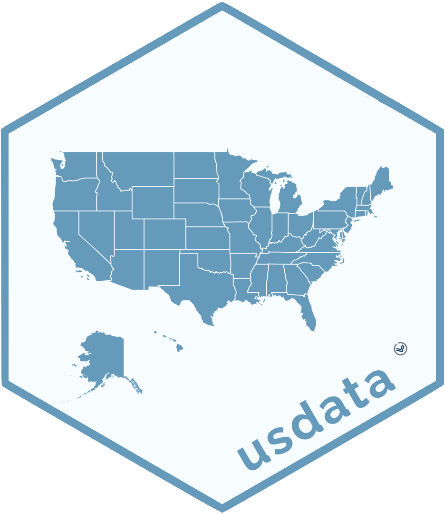

<!-- README.md is generated from README.Rmd. Please edit that file -->

# usdata <a href="https://openintrostat.github.io/usdata/"></a>

<!-- badges: start -->

[](https://CRAN.R-project.org/package=usdata)
[](https://github.com/OpenIntroStat/usdata/actions)
<!-- badges: end -->

This package contains demographic data on the United States at the
county and state levels. The data span multiple years. Sources include
the US Census, the American Community Survey, data distributed by the
Bureau of Labor Statistics, etc.

## Installation

You can install the package from [CRAN](https://CRAN.R-project.org)
with:

``` r
install.packages("usdata")
```

Additionally, you can install the development version of usdata from
GitHub with:

``` r
#install.packages("devtools")
library(devtools)
install_github("OpenIntroStat/usdata")
```

## Usage

The datasets from this package can be used in a teaching context for
data visualization and data manipulation exercises as well as for
modeling. Since data spans multiple years it’s also possible to use
these data to explore trends in the US over time.

## usdata and openintro

The datasets from this package are used in
[OpenIntro](https://www.openintro.org/) textbooks and other resources.
These datasets originally lived in the
[**openintro**](http://openintrostat.github.io/openintro/) package, up
until openintro 2.0.0. The motivation for extracting these datasets out
of the openintro package was to create a new package where we can
continue to add more data on the US at the state and county levels. For
those looking for a seamless experience with OpenIntro resources, note
that the contents of this package will be loaded along with the
openintro package as well, so that you can run `library(openintro)` and
use the datasets from usdata.

## Questions, bugs, feature requests

You can file an issue to get help, report a bug, or make a feature
request.

When filing an issue to get help or report a bug, please make a minimal
**repr**oducible **ex**ample using the
[reprex](https://reprex.tidyverse.org/) package. If you haven’t heard of
or used reprex before, you’re in for a treat! See
[here](https://www.tidyverse.org/help/) for additional reprex pointers.

Before opening a new issue, be sure to [search issues and pull
requests](https://github.com/openintrostat/usdata/issues) to make sure
the bug hasn’t been reported and/or already fixed in the development
version. By default, the search will be pre-populated with
`is:issue is:open`. You can [edit the
qualifiers](https://help.github.com/articles/searching-issues-and-pull-requests/)
(e.g. `is:pr`, `is:closed`) as needed. For example, you’d simply remove
`is:open` to search *all* issues in the repository, open or closed.

## Code of Conduct

Please note that the usdata project is released with a [Contributor Code
of
Conduct](https://contributor-covenant.org/version/2/0/CODE_OF_CONDUCT.html).
By contributing to this project, you agree to abide by its terms.
